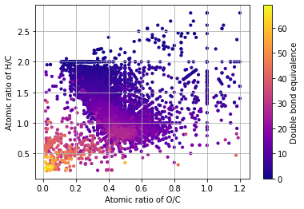
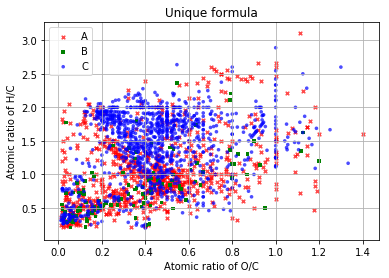
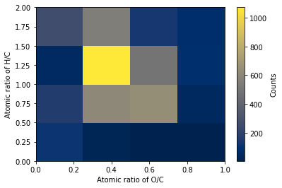
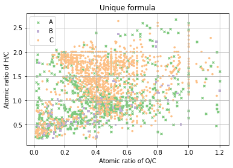
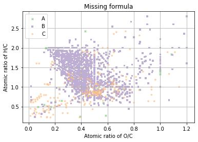
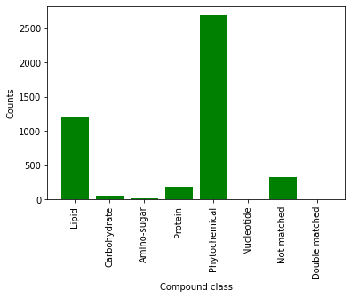
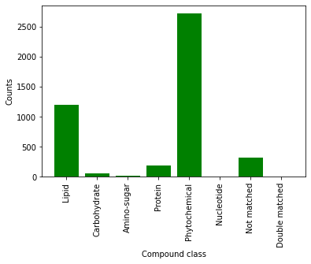
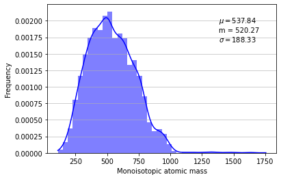
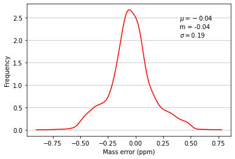

<h2> Pykrev User Guide </h2> 

**Hello:** Welcome to the Pykrev user guide. In this document we will explore how to set up and use PyKrev in the analysis of FT-MS data. <br> <br>
**What is Pykrev?** Pykrev is a python package containing functions that make it easier to process and visualise FT-MS data in python. PyKrev is intended to be used in the final part of mass spectrometry data analysis, after the spectra have been calibrated and peaks have been assigned to molecular formula. <br> <br>
**What data do I need to use PyKrev?** PyKrev was designed to analyse low weight molecular formula uncovered from high resolution mass spectra. The core data sets needed to use PyKrev are lists of molecular formula strings and corresponding numpy arrays of peak intensities and mz values. PyKrev can parse an output .csv file from PNNL's formularity software to generate these datasets for you. <br> <br>
**PyKrev dependencies:** PyKrev is written in Python 3. To use PyKrev you must have the matplotlib, numpy and pandas packages installed. For additional functionality such as gaussian density estimation and multivariate analysis, you will also need to install SciPy. <br> <br>
**Installing PyKrev:** To install pykrev use ``` pip install pykrev ```.


**Overview of PyKrev Module Organisation:**


**How to use this guide**: 
* Descriptions of functions will be given as bullet points. **```function_names```** are given in bold. 
* Python code demonstrating the functions will then be shown in the code cell(s) directly below.
* The guide is split up into three sections. 
 * Part 1: Formula: reading in data and basic formula manipulation. 
 * Part 2: Plotting: plotting van krevelen diagrams, histograms and other visualisations. 
 * Part 3: Diversity and multivariate analysis: performing statistical analysis on data and calculating chemical diversity.
* If you open this guide as a .ipynb file using Jupyter Notebook or Jupyter Lab you can run the code cells directly using the Python interpreter.
* To begin with we will import the packages we need.


```python
import numpy as np
import pandas as pd
import matplotlib.pyplot as plt
import pykrev as pk
```

<h3> Part 1: Basic formula manipulation </h3>

* 1.1: For almost all functionality PyKrev requires lists of molecular formula strings to work. For some functionality PyKrev also requires numpy arrays of corrsponding peak intensities and mz values. Import these into Python however you like. If you want to analyse formula assigned using [formularity software](https://omics.pnl.gov/software/formularity), you can use **```read_formularity```**: this function automatically filters out mass charge values that don't have C and H atoms assigned to them. <br> <br>
 * **```read_batch_formularity```** can be used to load in a batch formularity file where multiple spectra have been assigned using the same alignment.


```python
#METHOD 1: READ IN A SINGLE SPECTRA FORMULARITY FILE
#read a formularity file, and extract formula, peak intensities, mass charge ratios, and compound classes. 
formularity_A = pk.read_formularity('example_data/formularity_example_A.csv',pi_col = 'peak_intensity') #pi_col provides the column name for peak intensities.
A_formula, A_peak_intensity, A_mass_charge, A_mass_error, A_compound_class = formularity_A #unpack the tuple, note the order
#unpack the tuple directly into separate variables
B_formula,B_peak_intensity, B_mass_charge, B_mass_error, B_compound_class = pk.read_formularity('example_data/formularity_example_B.csv',pi_col = 'peak_intensity')
C_formula,C_peak_intensity, C_mass_charge, C_mass_error,C_compound_class = pk.read_formularity('example_data/formularity_example_C.csv',pi_col = 'peak_intensity')
#A_formula is a list
assert type(A_formula) == list
#A_peak_intensity, A_mass_charge and A_mass_error are nd.arrays
assert type(A_peak_intensity) == np.ndarray
```


```python
#METHOD 2: READ IN A BATCH SPECTRA FORMULARITY FILE
#read in a batch alignment formularity file using read_batch_formularity
batch_data, [] = pk.read_batch_formularity('example_data/batch_formularity.csv', ordination = False)
#this creates a pandas dataframe with the formula in a column alongside chemical parameters and the sample peak intensities
assert type(batch_data) == pd.DataFrame
# to extract formula and other parameters from batch data using boolean indexing 
# refer to https://pandas.pydata.org/pandas-docs/stable/user_guide/indexing.html for a guide on boolean indexing in pandas
D_formula = batch_data['formula'][batch_data['SAMPLE D'] > 0] #take all the formula where the peak intensity for sample D > 0 
D_peak_intensity = batch_data['SAMPLE D'][batch_data['SAMPLE D'] > 0] #take all the peak intensities for sample D that have non zero values
D_mass_charge = batch_data['mass'][batch_data['SAMPLE D'] > 0] # etc...
D_mass_error = batch_data['massError'][batch_data['SAMPLE D'] > 0]
D_compound_class = batch_data['cclass'][batch_data['SAMPLE D'] > 0]
```


```python
#METHOD 3: LOAD IN YOUR DATA MANUALLY
brite_df = pd.read_csv('example_data/Brite_DF.csv',index_col = 0) #Load the BRITE Biological molecules excel file
brite_formula = brite_df['F'].to_list() #extract the formula
brite_intensities = np.random.rand(len(brite_formula)) #generate a random array of peak intensities
```

* 1.2: Almost all functions in PyKrev take a list of molecular formula strings as input. Below we calculate C H N O P S counts in each formula, as well as element ratios using **```element_counts```** and **```element_ratios```**.


```python
A_counts = pk.element_counts(A_formula) #the result is a list of len(A_formula) in which each item is a dictionary containing C,H,N,O,P,S counts
A_ratios = pk.element_ratios(A_formula,ratios = ['HC','OC','NC']) #the result is a list of len(A_formula) in which each item is a dictionary containing the ratios given in ratios 
print(A_formula[16])
print(A_counts[16])
print(A_ratios[16])
```

    C8H8O4
    {'C': 8, 'H': 8, 'N': 0, 'O': 4, 'P': 0, 'S': 0}
    {'HC': 1.0, 'OC': 0.5, 'NC': 0.0}
    

* 1.3: It is also possible to calculate double bound equivalent, aromaticity index, and [nominal oxidation state of carbon](https://www.sciencedirect.com/science/article/abs/pii/S0016703711000378?via%3Dihub) using **```double_bond_equivalent```**, **```aromaticity_index```** and **```nominal_oxidation_state```**.


```python
A_dbe = pk.double_bond_equivalent(A_formula) # a warning message appears if there are any counts that give negative values, these are set to zero
A_ai = pk.aromaticity_index(A_formula,index_type = 'rAI') #index_type can be reformulated or original, and account for a modified O coefficient.
A_nosc = pk.nominal_oxidation_state(A_formula) #the output is a numpy array of len(counts)
```

    Warning: negative ai counts detected and set to zero.
    

* 1.4: pykrev can be used to calculate average, exact monoisotopic and nominal monoisotopic masses from a list of formula strings using **calculate_mass**. 
 * You can also calculate the kendrick mass and kendrick mass defect using **```kendrick_mass_defect```**. 


```python
A_atomic_mass = pk.calculate_mass(A_formula, method = 'average') ## exact weighted average mass
A_nominal_mass = pk.calculate_mass(A_formula, method = 'nominal') ## i.e. rounded monoisotopic masses
A_exact_mass = pk.calculate_mass(A_formula, method = 'monoisotopic') ## exact monoisotopic masses
A_kendrick_mass, A_kendrick_mass_defect = pk.kendrick_mass_defect(A_formula,A_mass_charge, base = ['CH2']) # Kendrick mass and kendrick mass defect
```

* 1.5: pykrev can also be used to filter out spectral interferences from a mass list caused by [high molecular weight doubly charged molecular ions](https://doi.org/10.1021/jasms.0c00353) using **```filter_spectral_interference```**.


```python
A_filter_mass, A_filter_formula, A_filter_peak_intensities = pk.filter_spectral_interference(A_mass_charge,A_formula,A_peak_intensity)
```

    87 masses removed.
    

* 1.6: Finally, PyKrev can be used to perform set analysis on several lists of molecular formula. It can give you the unique formula in each list using **```unique_formula```** , the missing formula in each list using **```missing_formula```** , or all the intersections between them using **```find_intersections```**.


```python
unique_formula  = pk.unique_formula(A_formula,B_formula,C_formula, group_labels = ['A','B','C']) #the result is a dictionary in which each key is a group_label and each value is a list containing the unique formula 
missing_formula = pk.missing_formula(A_formula,B_formula,C_formula, group_labels = ['A','B','C']) #
intersections =  pk.find_intersections(formula_lists = [A_formula,B_formula,C_formula],group_labels = ['A','B','C']) #output is a dictionary in which keys are tuples and values are sets containing formula 

intersections[('A','B','C')] #formula found in all lists 

print('# Unique formula A: ',len(unique_formula['A'])) #number of unique formula in A
print('# Unique formula A from intersections: ',len(intersections[('A',)])) #number of unique formula in A from intersections

print('# Missing formula A: ', len(missing_formula['A'])) #number of missing formula in A
print('# Missing formula A from intersections: ',len(intersections[('B','C')])) #number of missing formula in A from intersections 

#Note unique_formula['A'] is a list whereas intersections[('A',)] is a set
```

    # Unique formula A:  711
    # Unique formula A from intersections:  711
    # Missing formula A:  30
    # Missing formula A from intersections:  30
    

* 1.7: You can call ```help``` on any function to read the documentation.


```python
help(pk.find_intersections)
```

    Help on function find_intersections in module pykrev.formula.find_intersections:
    
    find_intersections(formula_lists, group_labels, exclusive=True)
        Docstring for function pyKrev.find_intersections
        
        ====================
        This function compares n lists of molecular formula and outputs a dictionary containing the intersections between each list.
        
        Use
        ----
        find_intersections([list_1,..,list_n],['group_1',...,'group_n'])
        
        Returns a dictionary in which each key corresponds to a combination of group labels 
        and the corresponding value is a set containing the intersections between the groups in that combination.  
        
        Parameters
        ----------
        formula_lists: a list containing n lists of molecular formula. Each item in the sub list should be a formula string.
        group_labels: a list containing n strings of corresponding group labels.
        exclusive: True or False, depending on whether you want the intersections to contain only unique values.
    
    

<h3> Part 2: Plotting </h3>

* 2.1: PyKrev can be used to make a range of van Krevelen style plots from your data. Plotting in PyKrev is performed using the [API interface of matplotlib](https://matplotlib.org/tutorials/introductory/pyplot.html), this means that you can continue to customise your plots once they have been produced using a range [matplotlib.pyplot commands](https://matplotlib.org/api/pyplot_summary.html). <br> <br>  
 * Plotting functions in Pykrev also return the figure and axes handles of the plot, so you can use the [object oriented interface of matplotlib](https://medium.com/@kapil.mathur1987/matplotlib-an-introduction-to-its-object-oriented-interface-a318b1530aed) to make additional alterations if you would like. This is not necessary to make professional looking figures so don't worry about these handles if you aren't sure on how to use them.   <br> <br>  
 * A standard van krevelen plot is made using **```van_krevelen_plot```** on a list of molecular formula strings. The function can take keyword arguments for [pyplot.scatter.](https://matplotlib.org/api/_as_gen/matplotlib.pyplot.scatter.html#matplotlib.pyplot.scatter)
    * You can apply patches to the plot denoting compound class boundaries (taken from those used by PNNL's formularity software) by passing the boundaries of interest in a list to ```patch_classes```.


```python
#Here we make a van Krevelen style plot where the y axis represents N/C values, and colour code the points by double bond equivalence 
plt.figure()
pk.van_krevelen_plot(A_formula, y_ratio = 'HC',c = A_dbe,s = 10,cmap = 'plasma') #van_krevele_plot takes any keyword arguments that can be passed to pyplot.scatter() 
cbar = plt.colorbar() #add a colour bar 
cbar.set_label('Double bond equivalence')
#PyKrev.van_krevelen_plot can take the value 'density' for the key word argument 'c' to colour code points based on kernel density
plt.figure()
pk.van_krevelen_plot(A_formula,c='density',s = 10)
plt.colorbar().set_label('Kernel Density')
plt.grid(False)
```


    

    


    

    


* 2.2: We can also make 2d histograms based on a list of molecular formula using **```van_krevelen_histogram```**. The function can take keyword arguments passed to [pyplot.hist2d](https://matplotlib.org/api/_as_gen/matplotlib.pyplot.hist2d.html). If the bin sizes are given as scalar values, a 'density index' is returned. This is a value between 0 and 1 made by dividing the average number of points by the number of points in the most populated bin, giving average relative density (for 100 bins a score of 1 means all bins are equally dispersed, and a score of 0.01 means all points fall into one bin).


```python
plt.figure()
fig, ax, d_index = pk.van_krevelen_histogram(A_formula,bins = [10,10],cmap = 'viridis') # van_krevelen_histogram takes any key word argument that can be passed to pyplot.hist2d
cbar = plt.colorbar()
cbar.set_label('Counts')

#a histogram can also be made with a range of values for bins
plt.figure()
fig, ax, d_index = pk.van_krevelen_histogram(A_formula,bins = [np.linspace(0,1,5),np.linspace(0,2,5)],cmap = 'cividis') # van_krevelen_histogram takes any key word argument that can be passed to pyplot.hist2d
cbar = plt.colorbar()
cbar.set_label('Counts')

```


    

    


    

    


* 2.4: The **```multi_van_krevelen_plot```** function plots several different lists of molecular formula onto the same van krevelen plot, using a different marker and colour for each. Below I plot each of the different compound classes in the [BRITE compounds with biological roles dataset](https://www.genome.jp/kegg-bin/get_htext?br08001.keg) with a different marker.   
 * Multi van krevelen plots require multiple molecular formula lists followed by key word arguments specifying the alpha value (transparency), colour, symbol type, edge colour and label that each of the ratio lists will be plotted with and compound class patches can be overlaid. Additionally the function accepts any keyword arguments for pyplot.scatter, with the exception of alpha, marker, c, edgecolors and label.


```python
#Specific analysis of compound classes in the brite dataset 
Organic_Acids = brite_df[brite_df['A'] == 'Organic acids']['F'].dropna()
Lipids = brite_df[brite_df['A'] == 'Lipids']['F'].dropna()
Carbohydrates = brite_df[brite_df['A'] == 'Carbohydrates']['F'].dropna()
Nucleic_acids = brite_df[brite_df['A'] == 'Nucleic acids']['F'].dropna()
Peptides = brite_df[brite_df['A'] == 'Peptides']['F'].dropna()
Vitamins_and_cofactors = brite_df[brite_df['A'] == 'Vitamins and Cofactors']['F'].dropna()
Steroids = brite_df[brite_df['A'] == 'Steroids']['F'].dropna()
Hormones_and_transmitters = brite_df[brite_df['A'] == 'Hormones and transmitters']['F'].dropna()
Antibiotics = brite_df[brite_df['A'] == 'Antibiotics']['F'].dropna()
```


```python
#multi_van_krevelen_plot of these compounds
plt.figure(figsize  = (10,7))
fig, ax = pk.multi_van_krevelen_plot(Organic_Acids,Lipids,Carbohydrates,Nucleic_acids,Peptides,Vitamins_and_cofactors,Steroids,Hormones_and_transmitters,Antibiotics,
                                            alphas = [0.8] * 9, #the transparency of the points
                                            colours = ['r','b','g','y','orange','c','m','k','xkcd:sky blue'], #point colours
                                            symbols = ['o','^','X','D','s','o','^','X','D'], #point symbols
                                            edge_colours = [None] * 9, #point edge colours
                                            group_labels= ['Organic Acids', 'Lipids', 'Carbohydrates','Nucleic acids','Peptides','Vitamins and cofactors','Steroids','Hormones and transmitters', 'Antibiotics'],
                                            patch_classes=['lipid-like','protein-like','carbohydrate-like'], #apply compound class patches
                                            patch_colors=['g','m','c'], #compound class patch colour 
                                            patch_alpha = 0.4, #compound class patch transparency
                                            patch_text= True) #apply labels to patches

legend = plt.legend(loc='best')
```


    

    


* 2.5: A special type of multi van krevelen plot is made using the **```unique_plot```** and the **```missing_plot```** functions. For multiple lists of formula, these functions perform a multi van krevelen plot in which either the unique or the missing compounds in each list are plotted on top of one another. In addition to creating a plot, these functions also return the unique or missing groups produced by **```unique_formula```** or **```missing_formula```**.


```python
plt.figure(figsize = (6,4))
fig, ax, unique_formula = pk.unique_plot(A_formula,B_formula,C_formula,s = 13,group_labels = ['A','B','C'],alphas = [1,1,1],symbols = ['x','s','o'], y_ratio = 'HC')
plt.title('Unique formula')
plt.legend()

plt.figure(figsize = (6,4))
fig, ax, missing_formula = pk.missing_plot(A_formula,B_formula,C_formula,s = 13,group_labels = ['A','B','C'],alphas = [0.7,1,0.7],symbols = ['x','s','o'])
plt.title('Missing formula')
plt.legend()
```


    <matplotlib.legend.Legend at 0x1fcbaae9550>


    

    


    

    


* 2.6: [**Kendrick mass defect plots**](https://doi.org/10.1021/acs.analchem.9b03333) are a useful way to identify chemically related compounds based on exact measurements. With pykrev you can make them using **```kendrick_mass_defect_plot```**.


```python
plt.figure(figsize = (10,7))
fig, ax ,(kendrickMass, kendrickMassDefect) = pk.kendrick_mass_defect_plot(A_formula[:400],A_mass_charge[:400],base = ['CH2'], s = 3, c = A_ai[:400])
plt.colorbar().set_label('Aromaticity Index')
```


    

    


* 2.7: **Atomic Class Plots** enable you to see the distribution of an element within your sample, and the summary statistics show the mean, median and standard deviation of that distribution. Make them using **```atomic_class_plot```**.


```python
plt.figure()
fig, ax, (mean,median,sigma) = pk.atomic_class_plot(A_formula, element = 'O', color = 'c', summary_statistics = True, bins = range(0,33))
```


    

    


* 2.8: **Compound class plots** are useful to see the breakdown of compound classes in a sample. Make them using **```compound_class_plot```**. There is more about the **```compound_class```** function in the next section.


```python
plt.figure()
fig, ax, (compounds, counts) = pk.compound_class_plot(A_formula,A_mass_charge, color = 'g', method = 'MSCC')
```


    

    


* 2.9: **Mass histograms** show the distribution of mass in your sample. You can specify the bin width in mass units, and the method used to calculate mass. You can visualise the data as histogram bars or using gaussian kernel density estimation (in which case the Y value will be a probability density function). Make them using **```mass_histogram```**.
 * You can also supply a list of mass error values using ```method = 'me'``` to visualise the distribution of mass error. 


```python
plt.figure()
fig, ax, (mean,median,sigma) = pk.mass_histogram(A_formula, method = 'monoisotopic', mz_list = A_mass_charge, bin_width = 40, summary_statistics=True, 
                                                 color = 'blue', alpha = 0.5, kde = True, kde_color = 'blue')
plt.figure()
fig,ax, (mean,median,sigma) = pk.mass_histogram(A_formula, method = 'me', me_list = A_mass_error, kde = True, hist = False, kde_color = 'red', summary_statistics=True)
```


    

    


    

    


* 2.10: **Mass spectrum** recreates a mass spectrum based on an assiged formula list. You can specify the method used to calculate mass, and whether or not to sum normalise the peak intensity list (divide by sum, so all intensities is sample sum to 1). **```mass_spectrum```** is the function name.


```python
plt.figure()
fig, ax = pk.mass_spectrum(A_formula,A_peak_intensity, method = 'monoisotopic',normalise = True, color = 'g',linewidth = 2)
plt.xlim(150,1000)

```


    (150.0, 1000.0)


    

    


* 2.11: **Finally, PyKrev can be used alongside UpSetPlot to make Upset plots, but that is covered in a [separate user guide](https://github.com/Kzra/pykrev/blob/master/docs/UpSetplotswithPyKrev.md)**

* 2.12: Matplotlib offers a range of customisation options to change the appearance of plots. Be sure to play around with key word arguments to get the plots just how you like them. In addition it's possible to [change the appearance of the text](https://matplotlib.org/tutorials/introductory/customizing.html) and [the overall style of the plot.](https://matplotlib.org/3.1.1/gallery/style_sheets/style_sheets_reference.html) Personally, I like the ggplot style sheet... but maybe that's just me. 

<h3> Part 3: Chemical diversity and multivariate analysis </h3>

* 3.1: PyKrev can be used to predict the compound class make up of a sample, it can also be used to compute diversity values (akin to biological diversity metrics) based on the peak intensities of molecular formula present in a sample. Finally, it can also be used to concatenate multiple formula and peak intensity lists into a sample data matrix which can then be used to perform statistical ordination such as PCA and PCoA. 

* 3.2 : To estimate the compound class composition of a sample, use the **```compound_class```** function. A variety of criteria can be used to predict compound class, which are discussed in the function's docstring. Below we compare the [MSCC algorithm](https://pubs.acs.org/doi/full/10.1021/acs.analchem.8b00529), the [KELL method](https://doi.org/10.1038/ncomms4804) and the KEGG_All method (which matches compounds to entries in the [KEGG Compound Database](https://www.genome.jp/kegg/compound/)).


```python
compounds, counts = pk.compound_class(A_formula,mass_list = A_mass_charge, method = 'MSCC') #The function returns a list of compounds of len (formula_list) and a dictionary containing the totals 
print(counts)
print('\n')
compounds, counts = pk.compound_class(A_formula,mass_list = A_mass_charge, method = 'KELL') #The function returns a list of compounds of len (formula_list) and a dictionary containing the totals 
print(counts)
print('\n')
compounds, counts = pk.compound_class(A_formula,mass_list = A_mass_charge, method = 'KEGG_All') #The function returns a list of compounds of len (formula_list) and a dictionary containing the totals 
print(counts)
```

    {'Lipid': 1195, 'Carbohydrate': 60, 'Amino-sugar': 11, 'Protein': 190, 'Phytochemical': 2720, 'Nucleotide': 0, 'Not matched': 316, 'Double matched': 0}
    
    
    Warning: negative ai counts detected and set to zero.
    {'Combustion-derived polycyclic aromatics': 113, 'Vascular plant-derived polyphenols': 101, 'Highly unsaturated and phenolic compounds': 3131, 'Aliphatic compounds': 1147}
    
    
    {'Not Matched': 4262, 'Hormones and transmitters': 0, 'Steroids': 16, 'Organic acids': 6, 'Polyketides': 42, 'SP  Sphingolipids': 0, 'Fatty acids related compounds': 1, 'Phytotoxins': 6, 'Flavonoids': 0, 'Carbohydrates': 10, 'Phenylpropanoids': 14, 'Marine biotoxins': 0, 'Lipids': 23, 'Shikimate / acetate-malonate pathway derived compounds': 2, 'GP  Glycerophospholipids': 0, 'Cyanotoxins': 0, 'Alkaloids': 0, 'ST  Sterol lipids': 10, 'Terpenoids': 60, 'Fungal toxins': 11, 'Antibiotics': 1, 'SL  Saccharolipids': 0, 'PK  Polyketides': 1, 'Peptides': 0, 'Nucleic acids': 0, 'Others': 2, 'Venoms': 0, 'GL  Glycerolipids': 0, 'FA  Fatty acyls': 22, 'Vitamins and Cofactors': 1, 'PR  Prenol lipids': 0, 'Amino acid related compounds': 2}
    

* 3.3: To compute diversity metrics we can use **```diversity_indices```**. **```Diversity_indices```** requires a list of molecular formula, and a corresponding list of peak intensities. Based on these datasets the function calculates molecular richness, abundance-based ([Shannon-wiener](https://en.wikipedia.org/wiki/Diversity_index#Shannon_index) and [Gini-simpson](https://en.wikipedia.org/wiki/Diversity_index#Gini%E2%80%93Simpson_index) and functional-based ([using rao's quadratic entropy](https://www.sciencedirect.com/science/article/pii/S0040580909001117)) diversity values for the sample. [Tanentzap et al. (2019)](https://www.pnas.org/content/116/49/24689) shows how these measurements can be applied in chemical analysis.


```python
A_diversity = pk.diversity_indices(A_formula,A_peak_intensity,verbose = True, indices = ['SW','DBE']) #diversity values are saved into a dictionary 
A_diversity['D_a_SW'] #shannon wiener diversity
A_diversity['D_f_DBE']#functional diversity based on double bond equivalence 
```

    Warning: duplicates detected in formula list. Remove to avoid inaccuracies.
    Warning: negative ai counts detected and set to zero.
    Abundanced based diversity:
    Shannon-Wiener Index: 6.277064176599099 
    
    Functional based diversity:
    Raos Quadratic Index (DBE):  3.7300928929728747
    


    3.7300928929728747


* 3.4: In order to cross compare molecular formula datasets in multivariate analysis it is first required to construct a sample data matrix in which each column represents a molecular formula each row a different sample. The len(rows) is equal to len(samples) and the len(columns) is equal to the len(set(all_formula)), where all_formula is all formula found across the samples. \[row,col\] value is the peak intensity of a particular molecular formula in a particular sample. If the formula is not present in a sample the peak intensity is set as impute value. We can construct this sample data matrix using **```ordination_matrix```**.


```python
sample_data_matrix = pk.ordination_matrix(molecular_formulas = [A_formula,B_formula,C_formula],
                                          peak_intensities = [A_peak_intensity,B_peak_intensity,C_peak_intensity],
                                          group_names = ['A','B','C'],
                                          impute_value = 0) #you can define a custom impute value, if 'nan' sets value as np.nan
all_formula = A_formula + B_formula + C_formula
assert len(sample_data_matrix.iloc[0,:]) == len(set(all_formula))
sample_data_matrix.iloc[:,1:10]
```


</style>
<table border="1" class="dataframe">
  <thead>
    <tr style="text-align: right;">
      <th></th>
      <th>C17H31N1O10</th>
      <th>C43H26N2O12</th>
      <th>C46H14N6O6</th>
      <th>C11H13N1O9</th>
      <th>C17H12N6O11</th>
      <th>C7H6N6O3</th>
      <th>C23H28O15</th>
      <th>C31H26O15</th>
      <th>C88H156O3</th>
    </tr>
  </thead>
  <tbody>
    <tr>
      <th>A</th>
      <td>1.29775e+06</td>
      <td>0</td>
      <td>0</td>
      <td>905806</td>
      <td>7.49521e+06</td>
      <td>1.9305e+06</td>
      <td>2.20263e+06</td>
      <td>1.10703e+07</td>
      <td>0</td>
    </tr>
    <tr>
      <th>B</th>
      <td>0</td>
      <td>0</td>
      <td>8.68334e+06</td>
      <td>0</td>
      <td>3.52697e+06</td>
      <td>0</td>
      <td>0</td>
      <td>8.73531e+06</td>
      <td>3.06943e+06</td>
    </tr>
    <tr>
      <th>C</th>
      <td>6.60775e+06</td>
      <td>5.62352e+06</td>
      <td>0</td>
      <td>3.58187e+06</td>
      <td>0</td>
      <td>0</td>
      <td>3.3494e+06</td>
      <td>1.23539e+07</td>
      <td>0</td>
    </tr>
  </tbody>
</table>
</div>


* 3.5: We can convert the peak intensities in the sample data matrix to relative intensities (so that each row sums to 1) by using **```relative_intensity```**


```python
ri_matrix = pk.relative_intensity(sample_data_matrix.T) 
ri_matrix = ri_matrix.T
assert sum(ri_matrix[0,:]) > .99 and sum(ri_matrix[0,:]) < 1.01 #rows sum to 1 
```

* 3.6: We could perform PCA (Principal component analysis) directly on the relative intensity matrix, or compute a non-euclidean distance measure, such as [bray-curtis dissimilarity](https://en.wikipedia.org/wiki/Bray%E2%80%93Curtis_dissimilarity) to perform PCoA (Principal coordinate analysis).  This can be done using **```bray_curtis_matrix```**.


```python
bray_curtis = pk.bray_curtis_matrix(ri_matrix) #note bray_curtis_matrix requires a numpy.array so won't work directly on sample_data_matrix
```

* 3.7: Our data is now ready for dimensionality reduction. [Click here for a guide on how to do PCA with PyKrev.](https://github.com/Kzra/pykrev/blob/master/docs/PCAwithPyKrev.md)

**That's the end of the user guide.** Thanks for reading and good luck! The package is still indevelopment and i'd greatly appreciate any feedback. If you'd like to contribute code or feature ideas, that'd be awesome too. 
* You can can contact me at ezra.kitson@ed.ac.uk. 
* Last update:  11/01/2020
